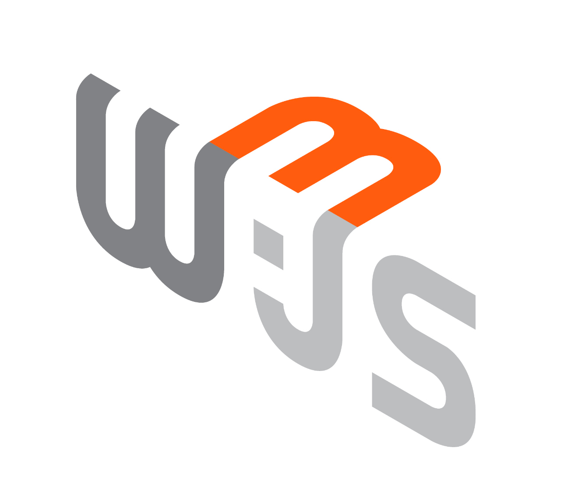

# Hey  bro

My name is **Chinh Vuong** and I'm a **Full Stack Blockchain Developer**, from  **Vietnam**.

## About me

- ✨ I have been learning programming since September 201
- ✨ I started working from January 20, specializing in blockchain development
- 🚀 Currently working as a **Full Stack Developer**
- 📚 Experienced in building **DApp projects** (lending, marketplace, trading platforms, social platforms, *to earn apps) across multiple blockchain networks
- 🔗 **Extensive experience** with **EVM networks** and **Solana**, plus exposure to **Cosmos, Bitcoin, Aptos...**
- 🎯 **Passionate** about building high-load, high-traffic systems and optimizing performance
- 💡 **Strong problem-solving mindset** with interest in discussing technical solutions and system optimization

## My Expertise

- **Frontend**: React.js, Next.js, TypeScript, Tailwind CSS
- **Backend**: Node.js, Nest.js, Express, Socket.io
- **Blockchain**: Smart Contract Integration, Web3.js, Ether.js, Solana Web3, The Graph
- **Smart Contracts**: Understanding and ability to create simple contracts with Solidity and Rust (Solana Anchor)
- **Databases**: MySQL, MongoDB, PostgreSQL, Redis
- **Other**: Kafka Microservices, Chrome Extension Development, Deployment (Vercel, EC2, Nginx)

## I code with

## Connect with me

- 📧 **Email**: [chinh.vuong201@gmail.com](mailto:chinh.vuong201@gmail.com)
- 💼 **LinkedIn**: [chinhvuong-dev](https://www.linkedin.com/in/chinhvuong-dev)
- 🌐 **Portfolio**: [Chinh Vuong's Portfolio](https://portfolio-chinhvuongs-projects.vercel.app/)
- 📝 **Blog**: [Chinh Vuong on Viblo](https://viblo.asia/u/chinhvuong)
